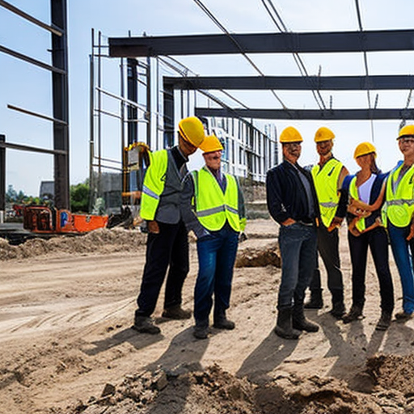
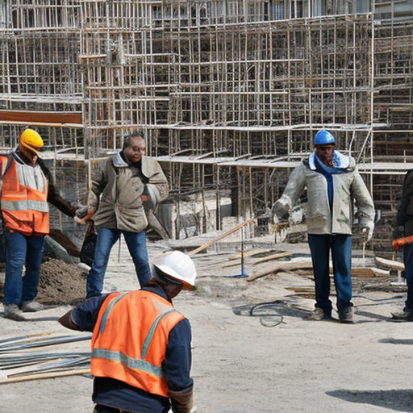

# HelmetGuard  
## Safety Classification of Construction Site Images Using Synthetic and Real Data

---

## Project Motivation

Construction sites are dangerous environments, and many accidents happen because workers do not follow basic safety rules. One of the simplest and most important rules is wearing a protective helmet, but in reality this is not always enforced.

In real sites, safety officers cannot watch all cameras and all areas all the time. This project checks whether a vision-based ML system can automatically classify construction site images as **safe** or **unsafe** based on helmet usage. The idea is to support safety monitoring, not replace human supervisors.

---

## Problem Definition

We formulate the task as a supervised **binary image classification** problem.

**Input:**  
An RGB image taken at a construction site.

**Output:**  
A single label for the whole image:

- **Safe** – all visible workers are wearing helmets  
- **Unsafe** – at least one visible worker is not wearing a helmet  

The model predicts only a global label. It does **not** detect or localize individual workers.

---

## Dataset

Because there are not many labeled real construction images with helmet annotations, we combine **synthetic** and **real** data.

### Synthetic Data

- ~**1,020 images** generated using a Stable Diffusion–based pipeline  
- Images show construction scenes with workers, with and without helmets  
- Prompts describe both safe and unsafe situations (e.g., “construction workers wearing yellow helmets” vs. “construction workers without helmets”)  
- Negative prompts were used to reduce unrealistic artifacts  
- All images were manually reviewed and cleaned  
- Each image was labeled as **safe** or **unsafe** based on helmet usage  

### Real Data

- Collected from public web sources  
- **40 safe** images and **19 unsafe** images  
- Split into training and test sets  
- The **unsafe** class is under-represented, so we oversampled unsafe samples during training to reduce class imbalance  

---

## Synthetic Data Generation

Synthetic images were generated with a diffusion-based generative model (Stable Diffusion) in a Colab environment.

- Text prompts specified: number of workers, presence/absence of helmets, and construction context (scaffolding, building site, etc.).  
- Negative prompts were used to reduce artifacts such as distorted faces, extra limbs, or non-realistic objects.  
- After generation, all images were manually inspected:
  - low-quality or ambiguous images were removed  
  - labels were checked to make sure “safe” really means everyone wears a helmet  

This cleaning step was important to keep the synthetic dataset consistent and to avoid noisy labels.

---

## Models and Training

We trained two image classification models:

1. **ResNet18**
   - Pretrained on ImageNet  
   - Standard 2-class classification head  
   - Input size: 224×224  

2. **ViT-B/16 (Vision Transformer)**
   - Pretrained on ImageNet  
   - Fine-tuned with a 2-class head  
   - Same input resolution and similar augmentations as ResNet18  

**Training setup (for both models):**

- Loss: cross-entropy  
- Optimizer: Adam, learning rate = 1e-4  
- Data augmentation:
  - random resized crops  
  - horizontal flips  
  - light color jitter  

---

## Experiments

We tested several training setups to understand the effect of synthetic data and a small amount of real data.

1. **Synthetic only**
   - Model: ResNet18  
   - Training only on synthetic images  

2. **Synthetic + few real**
   - Model: ResNet18  
   - Training on all synthetic images  
   - Plus a small real subset: 10 safe, 5 unsafe  

3. **Synthetic + real with oversampling**
   - Model: ResNet18  
   - Same as experiment 2  
   - Unsafe real images are oversampled during training to reduce class imbalance  
   - (In the table, “25 unsafe” refers to oversampled copies of the same unsafe images.)

4. **ViT with synthetic + real**
   - Model: ViT-B/16  
   - Same data setup as experiment 3 (synthetic + real with unsafe oversampling)

---

## Quantitative Results

We evaluate on a held-out **real test set** of 44 images (30 safe, 14 unsafe).  
The main metric is **accuracy**, and we also report per-class accuracy for `safe` and `unsafe`.

| Experiment | Model    | Train data                                     | Real acc | Safe acc | Unsafe acc |
|-----------|----------|-----------------------------------------------:|---------:|---------:|-----------:|
| 1         | ResNet18 | Synthetic only                                  | 31.5%    | 12.5%    | 85.7%      |
| 2         | ResNet18 | Synth + few real (10 safe, 5 unsafe)            | 63.6%    | 76.7%    | 35.7%      |
| 3         | ResNet18 | Synth + real (10 safe, 25 unsafe, oversampled)  | 52.3%    | 56.7%    | 42.9%      |
| 4         | ViT-B/16 | Synth + real (10 safe, 25 unsafe, oversampled)  | 63.6%    | 73.3%    | 42.9%      |

**Interpretation:**

- The **synthetic-only** model (Exp. 1) performs very poorly on real **safe** images, even though it does reasonably well on **unsafe** ones. This shows a strong domain gap.
- Adding just a few real images (Exp. 2) already improves performance on real data, especially for the **safe** class.
- Oversampling unsafe examples (Exp. 3) slightly improves unsafe accuracy but reduces performance on safe images.
- The **ViT model** (Exp. 4) achieves the best overall trade-off on the real test set, with higher accuracy on both classes compared to ResNet18 with oversampling.

Overall, the experiments show that:
- Synthetic data is helpful to bootstrap training when real data is limited.  
- However, even a **small** amount of real images is crucial for generalization to real construction scenes.  
- The choice of backbone (ResNet vs. ViT) also affects robustness under domain shift.

---

## Qualitative Examples (Image Grids)

To better understand the model behaviour, we include example image grids of synthetic and real data.

### Synthetic images

- Grid of safe synthetic scenes (all workers with helmets)  
- Grid of unsafe synthetic scenes (at least one worker without a helmet)  

 

### Real Images

To better understand how the model behaves on real data, we also show example grids of real images:

- A grid of **real safe** images from the test set  
- A grid of **real unsafe** images, including cases where the model sometimes makes mistakes  

.jpeg)  
.jpeg)

These examples help visualize the gap between synthetic and real data and show where the model still struggles (for example, crowded scenes or workers that appear very small in the image).

---

## Discussion and Limitations

- There is a clear **domain gap** between synthetic and real images (different lighting, backgrounds, clothing, camera quality, etc.).  
- The real dataset is relatively small, so the results might not generalize well to new construction sites or other countries.  
- The model performs only **scene-level classification** and does not detect or track individual workers or helmets.  
- There is a practical trade-off between different types of errors:
  - **False positives** (marking a safe image as unsafe) can create unnecessary alerts for operators.  
  - **False negatives** (marking an unsafe image as safe) are more dangerous from a safety point of view.  

Even with these limitations, the project shows that:

- Synthetic data can be used to **bootstrap training** when real data is limited.  
- Adding even a small number of **real labeled images** significantly improves performance on real construction images.

For details about the dataset structure and file locations, see the `data/` directory and the comments inside the training notebooks or scripts.
