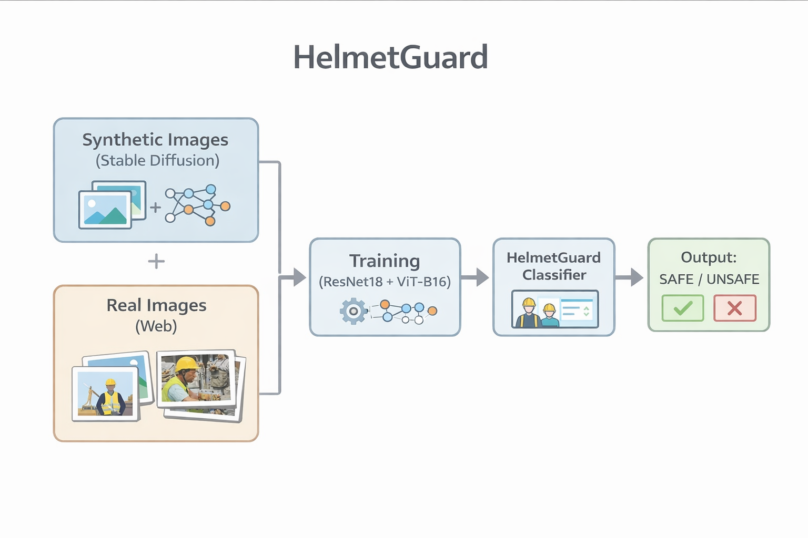

# HelmetGuard

Safety classification of construction site images using synthetic and real data.

---

## 1. What are we trying to do?

Many construction sites already have cameras, but checking safety is still done by people.
We wanted to see if we can look at **one image** from a site and decide:

> Is the scene **safe** (everyone wears a helmet) or **unsafe**?

The system is meant to help a safety officer with automatic alerts, not to replace them.

---

## 2. ML task

- **Input:** RGB image from a construction site camera.  
- **Output:** label `safe` or `unsafe`.  

Definitions:

- `safe` – all visible workers seem to wear helmets.  
- `unsafe` – at least one visible worker has no helmet.  

We only predict a **scene label**. We don’t detect individual people or draw boxes.

---

## 3. Data

There is no standard “helmet on site” dataset, so we built our own.

### Synthetic data

- About **700** synthetic images created with a Stable Diffusion pipeline in Colab.  
- Prompts control number of workers, with/without helmets, type of construction background.  
- We generated more images than needed and manually removed bad or ambiguous ones.  
- Each remaining image is labeled as `safe` or `unsafe`.

### Real data

- Collected manually from public web sources.  
- Total: **40 safe** + **19 unsafe** images.  
- Split:
  - **Train:** 10 safe, 25 unsafe (unsafe images are oversampled).  
  - **Test:** 30 safe, 14 unsafe (held out for final evaluation).

---

## 4. Models and training

We fine-tuned two pretrained classifiers:

- **ResNet18**
  - CNN, pretrained on ImageNet.
  - Final layer replaced with a 2-class head.

- **ViT-B/16 (Vision Transformer)**
  - Transformer vision model, pretrained on ImageNet.
  - Same 2-class head and input size.

Common setup:

- Input size: 224×224.  
- Loss: cross-entropy, optimizer: Adam (lr = 1e-4).  
- Augmentation: random resized crop, horizontal flip, light color jitter.  
- ResNet18 trained for 5 epochs, ViT for 3 epochs (GPU limits).

---

## 5. Experiments and results

All results are measured on the **real** test set (30 safe, 14 unsafe).

| Exp | Model    | Train data                            | Real acc | Safe acc | Unsafe acc |
|-----|----------|----------------------------------------|---------:|---------:|-----------:|
| 1   | ResNet18 | Synthetic only                         | 31.5%    | 12.5%    | 85.7%      |
| 2   | ResNet18 | Synth + few real (10 safe, 5 unsafe)   | 63.6%    | 76.7%    | 35.7%      |
| 3   | ResNet18 | Synth + real (10 safe, 25 unsafe)      | 52.3%    | 56.7%    | 42.9%      |
| 4   | ViT-B/16 | Synth + real (10 safe, 25 unsafe)      | 63.6%    | 73.3%    | 42.9%      |

Quick takeaways:

- Training **only on synthetic images** (Exp. 1) fails badly on real safe images → strong domain gap.  
- Adding just a **small real subset** (Exp. 2) already helps a lot on safe scenes.  
- Oversampling unsafe real images (Exp. 3) shifts the model to be more sensitive to unsafe cases.  
- **ViT-B/16** (Exp. 4) gives the best overall trade-off on the real test set.

---

## 6. Examples

We also looked at qualitative examples:

- Synthetic safe vs. unsafe image grids.  
- Real safe vs. unsafe images, including cases where the models make mistakes  
  (very small workers, heavy clutter, partial occlusions).

(See `images/` folder for the grids used in the report and slides.)

---

## 7. Limitations and future work

- Real dataset is small and may not represent all types of construction sites.  
- Synthetic images still look different from real ones (lighting, clothing, background).  
- Current model gives only a scene label, not per-worker detection.

Ideas for next steps:

- Collect a larger and more diverse real dataset.  
- Move to **helmet detection** instead of only safe/unsafe for the whole scene.  
- Try domain adaptation methods to reduce the synthetic → real gap.
